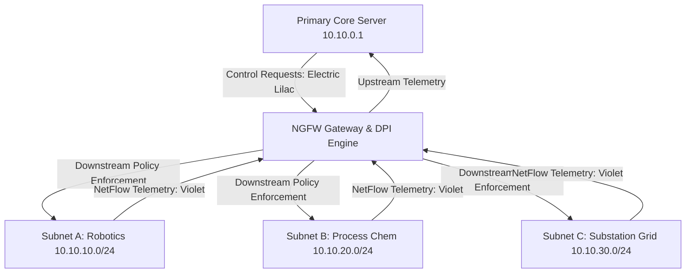

# Executive Brief: ABB Adaptive SOC & OT Micro-Segmentation Platform
**Document Classification:** Internal Technical & Strategic Overview  
**Target Organization:** ABB (Process Automation, Robotics & Discrete Automation, Electrification)  
**Architecture Standard:** IEC 62443-3-3 / Purdue Model (Levels 1–3) / NIST SP 800-82  

---

## 1. Executive Summary
The **ABB Adaptive SOC Engine & Micro-Segmentation Platform** is a specialized, real-time industrial cybersecurity operations center engineered for mission-critical Operational Technology (OT) and SCADA networks. Traditional IT security solutions fail in industrial environments because they prioritize data confidentiality over operational availability, often severing entire production cells when anomalies are detected. 

This platform bridges that gap by combining **sub-second Deep Packet Inspection (DPI)**, **hardware-enforced micro-segmentation**, and an **autonomous 7-step closed-loop remediation pipeline** that isolates threats, dynamic-rotates compromised IP leases, and re-establishes authenticated TLS 1.3 tunnels to the Primary Core Server—achieving threat neutralization with **zero aggregate production downtime**.

---

## 2. Core Technical Architecture & Functionality

### Key Technical Capabilities:
1. **Real-Time OT Protocol Streaming & DPI**:
   - Continuous packet ingestion monitoring ICS/SCADA protocols including **Modbus/TCP, IEC 60870-5-104, OPC UA, DNP3, and HTTPS**.
   - Protocol-aware inspection detects payload-level manipulation (e.g., forced register overrides, out-of-band actuator setpoints, unauthorized C2 beaconing).
2. **Interactive Micro-Segmentation Topology Visualizer**:
   - Visualizes live Purdue Model infrastructure across robotics, process instrumentation, and substation RTUs.
   - Distinct color-coded bidirectional conduits: downstream control commands (Electric Lilac `#615EEF`) and upstream telemetry (Violet `#9061F9`).
3. **Automated 7-Step Closed-Loop Incident Engine**:
   - **Step 01 (Detection - 3s)**: Anomaly flagged by DPI signature matching.
   - **Step 02 (Classification - 3s)**: CVE identification (e.g., CVE-2022-30777, CVE-2023-38035).
   - **Step 03 (Subnet Identification - 3s)**: Target CIDR isolated from lateral pivot paths.
   - **Step 04 (Risk Assessment - 3s)**: Real-time blast radius and physical asset risk computation.
   - **Step 05 (Network Isolation - 3s)**: Dynamic airgap quarantine applied to the affected node.
   - **Step 06 (Incident Logging - 3s)**: Immutable RFC-5424/CEF audit record committed to the SIEM.
   - **Step 07 (Automated Remediation - 5s)**: Dynamic DHCP IP lease rotation (e.g., `10.10.30.42` $\rightarrow$ `10.10.30.198`), local ARP cache purge, and mutual TLS 1.3 session re-establishment with Main Server `10.10.0.1`.
4. **Unified Single-Page Operational Dossier**:
   - Consolidates timestamps, CVE mappings, physical consequences (turbines, pressure vessels, robotic arms), affected parameters, DNS sinkholes, and audit trails in a single executive view.

---

## 3. How This Platform Delivers Value to ABB

### A. Protecting Human Life and Mission-Critical Infrastructure
In ABB's core deployments—such as automated paint shops, high-voltage substations, and chemical processing units—cyber incidents risk severe physical consequences (e.g., barometric chamber ruptures, robotic manipulator collisions, power grid blackouts). The platform’s physical consequence mapping and rapid containment protect both physical machinery and plant personnel.

### B. Prevention of Costly Production Downtime
In discrete manufacturing and continuous process industries, uncoordinated shutdowns cost thousands of dollars per minute. Rather than halting an entire substation or factory floor, the platform's granular micro-segmentation quarantines *only* the compromised node, rotates its network identity, and safely reconnects it to the core server within seconds.

### C. Turnkey Compliance with Global Industrial Standards
The system enforces and documents adherence to:
- **IEC 62443-3-3 / 4-2**: System security requirements, asset isolation, and zone/conduit micro-segmentation.
- **NIST SP 800-82 Rev 3**: OT system resilience, defense-in-depth, and incident response automation.
- **NERC CIP / NIS2 Directive**: Automated incident logging, non-repudiation, and mandatory supply-chain incident auditing.

### D. Competitive Differentiator for ABB Customer Solutions
ABB can package this Adaptive SOC technology into its **ABB Ability™** portfolio, offering clients a sovereign, self-healing cyber defense platform natively tailored for ABB drives, PLCs, RTUs, and robot controllers.

---

## 4. Conclusion
The ABB Adaptive SOC Engine transitions industrial cybersecurity from reactive damage control to **automated, self-healing resilience**. By combining real-time visibility, automated zero-trust containment, and seamless IP rotation/reconnection, it guarantees that ABB and its industrial customers remain **engineered to outrun—securely, leaner, and cleaner**.
